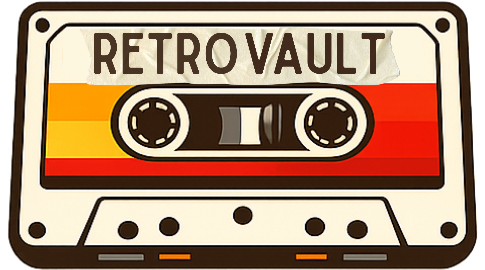

<div align="center">
    

# RetroVault Mobile

<strong>📱 Aplicação Mobile construída com React Native e Expo para iOS e Android.</strong>


</div>

## 📖 Sobre o Mobile

Este é o aplicativo mobile do RetroVault, desenvolvido com React Native e Expo. Oferecemos uma experiência nativa para dispositivos iOS e Android, permitindo aos usuários acessar todas as funcionalidades do RetroVault na palma da mão.

<div style="display:flex; justify-content:center; align-items:center; gap:20px; flex-wrap:nowrap;">

  

  

  

  

  

</div>

## 🏗️ Estrutura do Projeto

```
mobile/
├── app/                # Expo Router (file-based routing)
│   ├── _layout.tsx     # Layout principal
│   └── +not-found.tsx  # Página 404
├── components/         # Componentes reutilizáveis
│   ├── ui/             # Componentes base
│   └── shared/         # Componentes compartilhados
├── services/           # Serviços (API, storage)
├── assets/             # Imagens, fontes, ícones
├── .env                # Variáveis de ambiente (ignorado pelo git)
├── app.json            # Configuração do Expo
└── package.json        # Dependências do Mobile
```

## ⚙️ Pré-requisitos

- [Node.js](https://nodejs.org/) >= 18
- [pnpm](https://pnpm.io/) >= 9
- [Expo CLI](https://docs.expo.dev/get-started/installation/)
- [Expo Go](https://expo.dev/go) (para testar no dispositivo)

### Para desenvolvimento iOS:
- macOS
- Xcode
- CocoaPods

### Para desenvolvimento Android:
- Android Studio
- Java JDK 11+

## 🛠️ Instalação

```bash
# Na raiz do monorepo
pnpm install

# Rodar apenas o Mobile
pnpm --filter=mobile dev
```

## 🏃 Executando

### Desenvolvimento
```bash
# Da raiz do monorepo
pnpm --filter=mobile dev

# Ou usando turbo
turbo run dev --filter=mobile
```

### Rodar em dispositivos específicos
```bash
# iOS Simulator
pnpm --filter=mobile ios

# Android Emulator
pnpm --filter=mobile android

# Web (preview)
pnpm --filter=mobile web
```

### QR Code para Expo Go
Após rodar `pnpm dev`, escaneie o QR Code com:
- **iOS:** Aplicativo Câmera
- **Android:** Aplicativo Expo Go

## 🚀 Tecnologias

| Tecnologia | Função |
|-----|------------|
|  | Plataforma para apps React Native |
|  | Framework para aplicativos nativos |
|  | Linguagem com tipagem estática |
|  | Roteamento file-based para React Native |
|  | Orquestração do Monorepo e Cache de Build

## 📦 Dependências Principais

```json
{
  "dependencies": {
    "expo": "~54.0.33",
    "expo-status-bar": "~3.0.9",
    "react": "19.1.0",
    "react-native": "0.81.5"
  }
}
```

### Build Local

```bash
# Android APK
pnpm --filter=mobile build:android

# iOS (somente macOS)
pnpm --filter=mobile build:ios
```

## 📱 Testando no Dispositivo

### Android
1. Instale o [Expo Go](https://play.google.com/store/apps/details?id=host.exp.exponent)
2. Conecte-se à mesma rede Wi-Fi do seu computador
3. Escaneie o QR Code no terminal com o app Expo Go

### iOS
1. Instale o [Expo Go](https://apps.apple.com/app/expo-go/id982107779)
2. Conecte-se à mesma rede Wi-Fi do seu computador
3. Escaneie o QR Code no terminal com o app Câmera
4. Toque na notificação para abrir no Expo Go

## 👥 Nossa Equipe

### [João Teixeira](https://github.com/ts-joao)
**Tech Lead & Fullstack Developer**
- 🏗️ **Arquitetura:** Responsável pela estrutura e organização da arquitetura do projeto.
- 🗄️ **Database:** Realizou a modelagem completa do banco de dados.
- 👨‍💻 **Desenvolvimento:** Desenvolveu a API, realizou a integração entre Back e Front, e atuou no desenvolvimento Web e Mobile.
  
### [Baruki Bytes](https://github.com/Baruki-Bytes)
**Project Owner & Fullstack Developer**
- 📑 **Gestão:** Responsável pela visão do produto (PO) e requisitos.
- 👨‍💻 **Desenvolvimento:** Desenvolveu a interface Web e auxiliou no desenvolvimento Backend.

### [Felipe Farias](https://github.com/felipinho3105)
**Frontend Developer**
- 👨‍💻 **Desenvolvimento:** Desenvolveu a interface Web do projeto e auxiliou no desenvolvimento Mobile.

### [Lucas Alves](https://github.com/ktzxs)
**Fullstack Developer**
- 👨‍💻 **Desenvolvimento:** Desenvolveu o Backend e auxiliou no desenvolvimento Frontend Mobile.

### [Luiz Henrique](https://github.com/troninho69)
**Fullstack Developer**
- 👨‍💻 **Desenvolvimento:** Desenvolveu o Frontend Mobile e auxiliou no desenvolvimento da API.

---

### Feito cuidadosamente com Expo 🚀