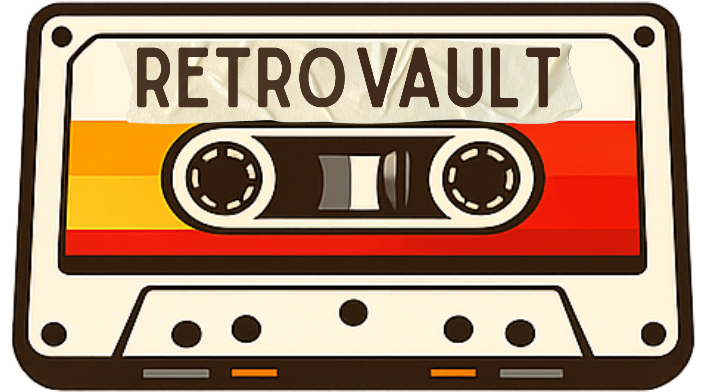

<div align="center">
    

# RetroVault Web

### 🌐 Aplicação Web construída com Next.js para uma experiência moderna e responsiva.


</div>

<br>
<p align="center">
  
</p>
<br>

## 📖 Sobre o Web

Este é o frontend web do RetroVault, desenvolvido com Next.js e App Router. Nossa aplicação oferece uma interface moderna, responsiva e otimizada para performance, permitindo aos usuários acessar todo o ecossistema RetroVault através do navegador.

## 🏗️ Estrutura do Projeto

```
web/
├── src/
│   ├── app/              # App Router
│   │   └── page.tsx      # Página inicial
│   ├── components/       # Componentes reutilizáveis
│   ├── lib/             # Utilitários e configurações
│   ├── hooks/           # Custom hooks
│   ├── types/           # Tipos TypeScript
│   └── styles/          # Estilos globais
├── public/              # Arquivos estáticos
│   ├── images/         # Imagens
│   └── icons/          # Ícones
├── .env.local           # Variáveis de ambiente (ignorado pelo git)
├── next.config.js       # Configuração do Next.js
├── tailwind.config.ts   # Configuração do Tailwind
└── package.json         # Dependências do Web
```

## 🚀 Tecnologias

| Tecnologia | Função |
|-----|------------|
|  | Framework React com SSR e App Router |
|  | Biblioteca para construção de interfaces |
|  | Linguagem com tipagem estática |
|  | Framework CSS utilitário |
|  | Orquestração do Monorepo e Cache de Build

## ⚙️ Pré-requisitos

- [Node.js](https://nodejs.org/) >= 18
- [pnpm](https://pnpm.io/) >= 9

## 🛠️ Instalação

```bash
# Na raiz do monorepo
pnpm install

# Rodar apenas o Web
pnpm --filter=web dev
```

## 🏃 Executando

```bash
# Da raiz do monorepo
pnpm --filter=web dev

# Ou usando turbo
turbo run dev --filter=web
```

A aplicação estará disponível em http://localhost:3000

### Produção
```bash
# Build
pnpm --filter=web build

# Start
pnpm --filter=web start
```

## 🎨 Features

- ✅ **App Router** - Roteamento moderno do Next.js 14
- ✅ **Server Components** - Renderização otimizada no servidor
- ✅ **Dark Mode** - Tema claro e escuro
- ✅ **Responsive** - Design adaptável para todos os dispositivos
- ✅ **SEO Optimized** - Meta tags e estrutura otimizada
- ✅ **Type Safe** - TypeScript em todo o código
- ✅ **Performance** - Otimizações automáticas do Next.js

## 📦 Dependências Principais

```json
{
  "dependencies": {
    "next": "^15.1.6",
    "react": "^19.0.0",
    "react-dom": "^19.0.0",
    "typescript": "^5.7.3",
    "tailwindcss": "^3.4.1",
    "tailwind-merge": "^2.6.0"
  }
}
```

## 👥 Nossa Equipe

### [João Teixeira](https://github.com/ts-joao)
**Tech Lead & Fullstack Developer**
- 🏗️ **Arquitetura:** Responsável pela estrutura e organização da arquitetura do projeto.
- 🗄️ **Database:** Realizou a modelagem completa do banco de dados.
- 👨‍💻 **Desenvolvimento:** Desenvolveu a API, realizou a integração entre Back e Front, e atuou no desenvolvimento Web e Mobile.
  
### [Baruki Bytes](https://github.com/Baruki-Bytes)
**Project Owner & Fullstack Developer**
- 📑 **Gestão:** Responsável pela visão do produto (PO) e requisitos.
- 👨‍💻 **Desenvolvimento:** Desenvolveu a interface Web e auxiliou no desenvolvimento Backend.

### [Felipe Farias](https://github.com/felipinho3105)
**Frontend Developer**
- 👨‍💻 **Desenvolvimento:** Desenvolveu a interface Web do projeto e auxiliou no desenvolvimento Mobile.

### [Lucas Alves](https://github.com/ktzxs)
**Fullstack Developer**
- 👨‍💻 **Desenvolvimento:** Desenvolveu o Backend e auxiliou no desenvolvimento Frontend Mobile.

### [Luiz Henrique](https://github.com/troninho69)
**Fullstack Developer**
- 👨‍💻 **Desenvolvimento:** Desenvolveu o Frontend Mobile e auxiliou no desenvolvimento da API.

---

### Feito cuidadosamente com Next.js 🚀